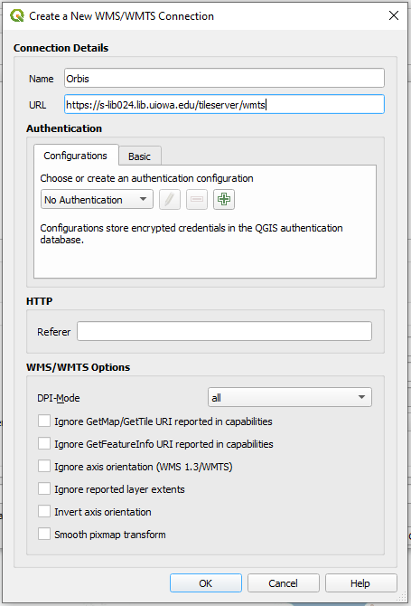
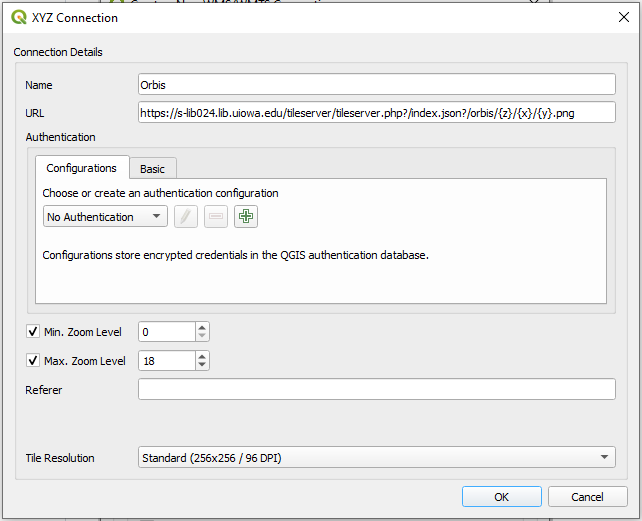
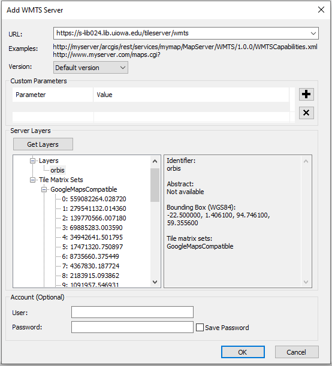

# Orbis Sample
Proof of concept tile service with Orbis tiles...

## 1. To use these tiles in a Leaflet map (see a sample [here](https://jebowe3.github.io/orbis_sample/index.html)):

```javascript
var Orbis_Tiles = L.tileLayer('http://s-lib024.lib.uiowa.edu/tileserver/tileserver.php?/index.json?/orbis/{z}/{x}/{y}.png', {
  minZoom: mapMinZoom,
  maxZoom: mapMaxZoom,
  bounds: mapBounds,
  opacity: 1.0
}).addTo(map);
```

## 2. To use these tiles in QGIS:

### As a WMTS:

Use the link http://s-lib024.lib.uiowa.edu/tileserver/wmts as shown in the following screenshot.

  
**Figure 01.** Accessing WMTS in QGIS

### As XYZ Tiles:

Use the link http://s-lib024.lib.uiowa.edu/tileserver/tileserver.php?/index.json?/orbis/{z}/{x}/{y}.png as shown in the following screenshot.

  
**Figure 02.** Accessing XYZ tiles in QGIS

## 3. To use these tiles in ArcMap:

### As a WMTS:

Use the link http://s-lib024.lib.uiowa.edu/tileserver/wmts as shown in the following screenshot.

  
**Figure 03.** Accessing WMTS in ArcMap
